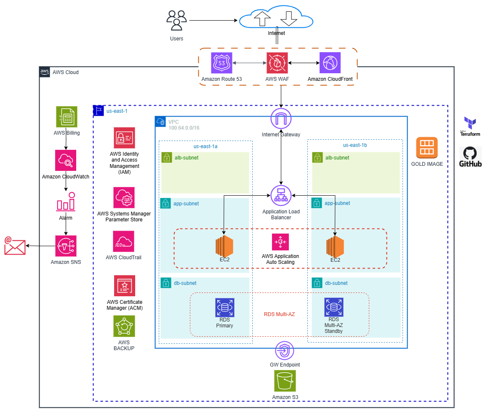

<h1 align="center"> AWS Workshop 24</h1>

  <a href="#Challenge">The challenge</a>&nbsp;&nbsp;&nbsp;|&nbsp;&nbsp;&nbsp;  
  <a href="#ItemsTo BeEvaluated">Assessment</a>&nbsp;&nbsp;&nbsp;|&nbsp;&nbsp;&nbsp;  
  <a href="#Technologies">Technologies</a>&nbsp;&nbsp;&nbsp;|&nbsp;&nbsp;&nbsp;
  <a href="#Contributors">Contributors</a>&nbsp;&nbsp;&nbsp;|&nbsp;&nbsp;&nbsp;

## 🚀 THE CHALLENGE

Cloud Treinamentos needs to migrate a PHP application to the cloud, strictly following the principles of security, scalability and high availability for any application in the AWS cloud.

## 🎲 PURPOSE

## 📝 ASSESSSMENT
[X] Presentation 
[X] Documentation - technical details 
[X] AWS Services used in the purposed Architecture 
[X] Participation of group members 
[X] Demo 

## 🛠 TECHNOLOGIES

- AWS Services (Route53, Load Balancing, AutoScaling, ECS Fargate, ...)
- Terraform
- GitHub and GitHub Actions
- MariaDB
- PHP

## ✅ CONTRIBUTORS

<table style="width:100%">
  <tr>
    <td align="center"><a href="https://www.linkedin.com/in/victor-cleber/?locale=en_US"> <b>Victor Cleber</b></a> </td>
    <td align="center"><a href="https://www.linkedin.com/in/juan-versolato-lopes?originalSubdomain=ar"> <b>Juan Versolato</b></a> </td>
    <td align="center"><a href="https://www.linkedin.com/in/marcos-meneghette-43119177/?originalSubdomain=br"> <b>Marcos Meneghette</b></a> </td>
  </tr>  
</table>